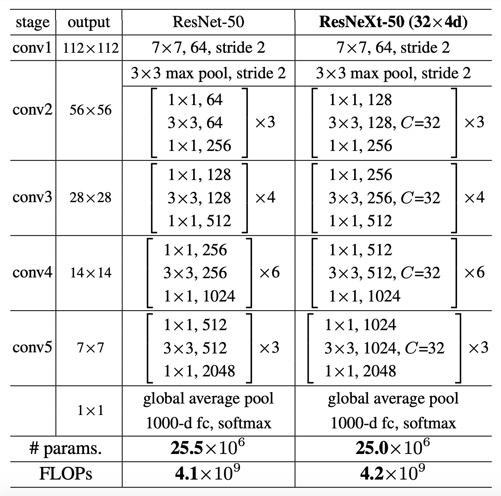
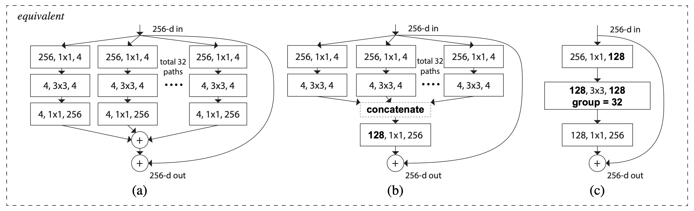

# ResNeXt Implementation with Pytorch


## 0. Develop Environment
```
numpy == 1.17.2
scipy == 1.3.1
torch == 1.5.1 + cu101
Pillow == 6.2.2
lmdb == 0.97
opencv-python == 3.4.1.15
cryptography == 2.9.2
h5py == 2.7
six == 1.12.0
```
- Pytorch : Stable (1.5) - Linux - Python - CUDA (10.1)
- Using Single GPU (not tested on cpu only)


## 1. Explain about Implementation


## 2. Brief Summary of *'Aggregated Residual Transformations for Deep Neural Networks'*

### 2.1. Goal
- Improve performance of image classification with low complexity

### 2.2. Intuition
- VGGNet & ResNet : stack layers strategy
  * Pros
    * Easy to design architecture
    * Reduce risk of over-adapting to a specific dataset due to simplicity of the rule
  * Cons
    * Reduce the free choices of hyperparameters
    * High complexity
- Inception : split-transform-merge strategy
  * Pros
    * Compelling accuracy with low complexity
  * Cons
    * Hard to design architecture
    * Many factors and hyperparameters to be designed
- ResNeXt : use both strategy by repeat layers while exploiting the split-transform-merge strategy in easy extensible way
  * Cardinality : size of the set of transformation

### 2.3. Dataset
- ImageNet-1K, ImageNet-5K
- CIFAR-10, CIFAR-100
- COCO
- For simplicity, details are provided only on ImageNet dataset

### 2.4. ResNeXt Configurations


- Batch normalization : after each convolution and before activation
- Activation function : ReLU
- 50, 101 layer for ImageNet, 29 layer for CIFAR

### 2.5. ImageNet Classification Task
#### 2.5.1. Train  
- Data Pre-processing
  * Random resize : resize with shorter side randomly sampled in [256, 480]
  * Random crop 224*224
  * Random horizontal flipping
  * Random RGB color shift
  * Normalization : per-pixel mean subtraction
- Train Details
  * Multinomial logistic regression objective
  * Mini-batch gradient descent based on backpropagation
    * Batch size : 256
    * Learning rate : 0.1
    * Nesterov momentum : 0.9
    * L2 weight decay : 0.0001
  * Learning rate scheduler : decrease by a factor of 10 on 31, 61, 91 epoch

#### 2.5.2. Test
- Data Pre-processing
  * Resize : resize with shorter side of length 256
  * Center crop
  * Normalization : per-pixel mean subtraction
- Ensemble
  * Combine the outputs of several models by averaging their soft-max class posteriors
  * Improves the performance due to complementarity of the models


## 3. Reference Paper
- Aggregated Residual Transformations for Deep Neural Networks [[paper]](https://arxiv.org/pdf/1611.05431.pdf)
